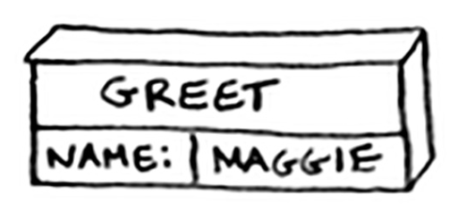

# Chapter 3 - Recursion

- “People either love it or hate it, or hate it until they learn to love it a few years later”
- There is no performance benefit to using recursion, but it makes the solution clearer.

### Base case and the recursive case

- When you write a recursive function, you have to tell it when to stop recursing. Otherwise, it’s easy to write a function that ends up in an infinite loop because a recursive function calls itself.
- That’s why every recursive function has two parts: **the base case** and **the recursive case**.

```jsx
function countdown(num) {
	console.log(num)
	if (num <= 1) { // base case
		return;
	} else { // recursive case
		countdown(num - 1);
	}
}

countdown(3) // 3, 2, 1
```

### The stack

- A stack is a data structure that lets you push an item to the list and pop an item.
- It is last-in-first-out (LIFO).

### The call stack

- Your computer uses a stack internally called the call stack.
- Every time you make a function call, the computer saves the values for all the variables for that call in memory. It uses a stack to keep track of the function call order.

### Call stack example

```jsx
function greet(name) {
	console.log("hello, " + name);
	greet2(name);
	console.log("getting ready to say bye");
	bye();
}

function greet2(name) {
	console.log("how are you " + name);
}

function bye() {
	console.log("bye");
}

greet("maggie");
```

- First, the computer allocates memory for `greet` function. Then it prints `“hello maggie”`
    
    
    
- Second, it allocates memory for `greet2` function. Then it prints `"how are you maggie"`
    - At this stage, `greet` function is partially completed. When you call a function from another function, the calling function is paused in a partially completed state.
    - All the values of the variables for that function are still stored in memory.
    
    
    
- Now that you’re done with `greet2` function, you’re back to the `greet` function, and you pick off where you left off. It prints `"getting ready to say bye"` then calls `bye` function.

### The call stack with recursion

```python
# iterative
def look_for_key(main_box):
	pile = main_box.make_a_pile_to_look_through()
	while pile is not empty:
		box = pile.grab_a_box()
		for item in box:
			if item.is_a_box():
				pile.append(item)
			elif item.is_a_key():
				print "found the key!"

# recursive
def look_for_key(box):
	for item in box:
		if item.is_a_box():
			look_for_key(item)
		elif item.is_a_key():
			print "found the key!"
```

- You don’t have to keep track of the pile of boxes yourself, because the stack does it for you.
- Using the stack is convenient, but there’s a cost: saving all the info can take up a lot of memory.
- When your stack is too tall, that means your computer is saving information for many function calls. At that point, you have two options:
    - Rewrite your code to use a loop instead.
    - Use `tail recursion`.

### Recap

- Recursion is when a function calls itself.
- Every recursive function has two cases: the base case and the recursive case.
- A stack has two operations: push and pop.
- All function calls go onto the call stack.
- The call stack can get very large, which takes up a lot of memory.

### Things we should do from Chapter 3

- research `tail recursion` ([https://stackoverflow.com/questions/33923/what-is-tail-recursion](img/https://stackoverflow.com/questions/33923/what-is-tail-recursion))
    - Tail recursion is a useful form of recursion that could eliminate the space overhead incurred by the recursive function calls.
    - [https://stackoverflow.com/a/37010](img/https://stackoverflow.com/a/37010)

### Neet codes

- [Reverse linked list](img/https://leetcode.com/problems/reverse-linked-list/)
    
    ```jsx
    var reverseList = function(head) {
         if(head === null) {
            return head;
        }
     
        let newHead = head;
        if(head.next !== null) {
            newHead = reverseList(head.next);  
            head.next.next = head;
        } 
        
        // the final one has to point to null
        // the middle nodes , doesn't matter
        head.next = null
        
        return newHead;
    }
    ```
    
- [Merge 2 linked lists](img/https://leetcode.com/problems/merge-two-sorted-lists/)
    
    ```jsx
    var mergeTwoLists = function(list1, list2) {
        if(!list1){
            return list2;
        }
        
        if(!list2) {
            return list1;
        }
    
        if(list1.val <= list2.val) {
           list1.next = mergeTwoLists(list1.next, list2);
           return list1; 
        } else {
            list2.next = mergeTwoLists(list1, list2.next);
            return list2
        }        
    
    }
    ```