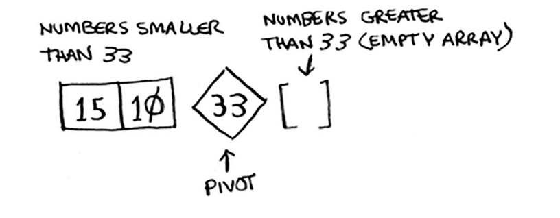
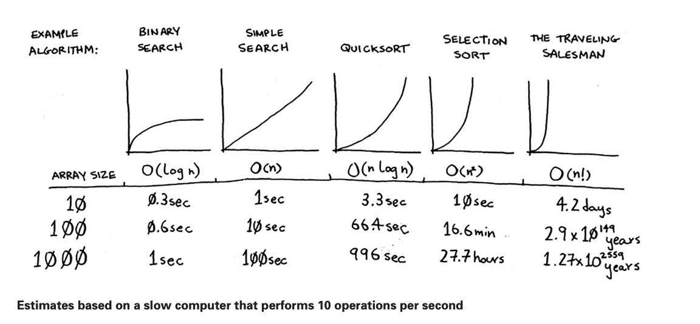
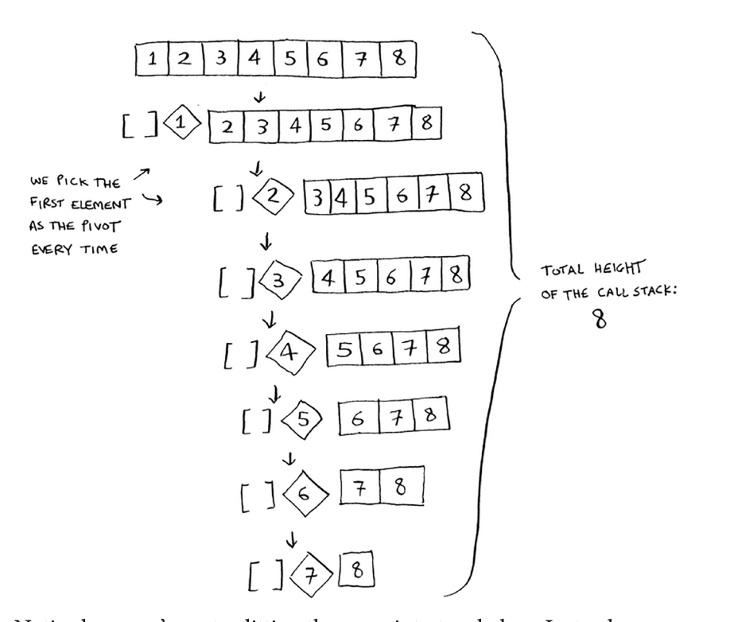
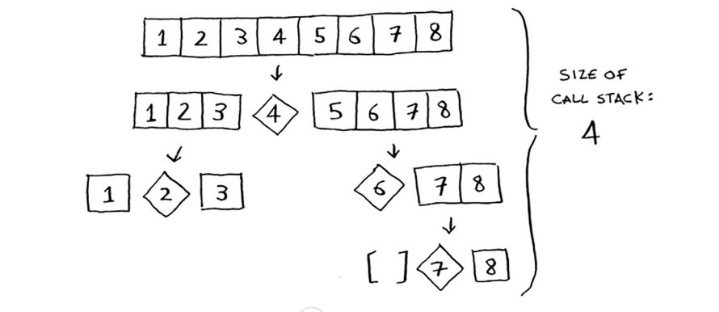

# Chapter 4 - Quick sort

### Divide & conquer (D&C)

- D&C algorithms are recursive algorithms. To solve a problem using D&C, there are two steps:
    1. Figure out the base case. This should be the simplest possible case.
    2. Divide & decrease your problem until it becomes the base case.

### Sum up numbers in a list

- Given an array [2,4,6], add up and return the total
    1. Base case: if array has 0 element, sum is 0
    2. Reduce problem size: move closer to an empty array with every recursive call

```jsx
function sum(array) {
	if(!array.length) { // base case
	 return 0;
  }
  
  return array[0] + sum(array.slice(1)); // reduce problem size
}
```

- Tip: when you’re writing a recursive function involving an array, the base case is often an empty array or an array with one element. If you’re stuck, try that first.

### Count the number of items in a list

1. Base case: If array is empty, count is 0
2. Reduce problem size: first item + count of the rest

```jsx
function count(array){
	if(!array.length) { // base case
		return 0;
	}

  return 1 + count(array.slice(1)); // reduce problem size
}
```

### Find the maximum number in a list

1. Base case: if array has one element, that is the max
2. Reduce problem size: compare first item to the max from the rest of the array

```jsx
function findMax(array){
	if(array.length === 1) { // base case
		return array[0];
	}
   
  const subMax = findMax(array.slice(1)); // reduce problem size
	return array[0] > subMax ? array[0] : subMax;
}
```

### Quick sort

- Quick sort is a sorting algorithm that is much faster than selection sort and is frequently used in real life. It uses D&C.
    1. Base case: array with one element doesn’t need to be sorted
    2. Reduce problem size:
        1. Pick a pivot
        2. Partition array into two subarrays: elements less than the pivot and elements greater than the pivot
        3. Call quick sort recursively on the two subarrays
        4. quicksort(small subarray) + pivot + quicksort(big subarray)

### Quick sort example

- Using divide & conquer to sort `[33, 15, 10]`
1. Pick an element from the array. This element is called `pivot`.
2. Now use the first item as `pivot` `33`.
3. Find the elements smaller than the pivot and the elements larger than the pivot ⇒ This is called `partitioning`, now we have:
    1. The sub-array of all numbers less than the pivot `[15,10]`
    2. The pivot
    3. The sub-array of all numbers larger than the pivot `[]`
4. Sort the sub-arrays
5. The results will be `sorted sub array` + `pivot` + `sorted sub array`

```jsx
	quicksort([15,10]) + [33] + quicksort([])
```



### Inductive proofs

- Inductive proofs are one way to prove that your algorithm works.
- Each inductive proof has two steps: the base case and the inductive case.
- For example, suppose we want to prove that I can climb to the top of a ladder.
    - Inductive case: if my legs are on a rung, I can put my legs on the next rung.
    - Base case: my legs are on the first rung.
    - Therefore, I can climb the entire ladder, going up one rung at a time.

### Big O revisited



- Quick sort is unique, because its speed **depends on the pivot you choose**.
- Merge sort is **O(n log n)**
    - Merge sort is a recursive algorithm that continuously splits the array in half until it cannot be further divided
    
    ```jsx
    step 1: start
    step 2: declare array and left, right, mid variable 
    step 3: perform merge function.
            mergesort(array, left, right)
            mergesort(array, left, right)
            if left > right
            return
            mid = (left + right)/2
            mergesort(array, left, mid)
            mergesort(array, mid+1, right)
            merge(array, left, mid, right)
    step 4: Stop
    ```
    
- In the worst case, quick sort can takes **O(n^2)** times
- But in the average, quick sort takes **O(n log n)** times

### Merge sort vs quick sort

- If you are trying to print [2,4,6,8,10]
    - function `print_items`: 2 4 6 8 10
    - function `print_items2`: <sleep> 2 <sleep> 4 <sleep> 6 <sleep> 8 <sleep> 10 <sleep>
- When the time complexity are the same (both are O(n)), the **constant** makes a difference.
- Quicksort & merge sort both have O(n log n) time, but quicksort is faster because it has a smaller constant than merge sort.

### Average case vs worst case

- The performance of quicksort heavily depends on the pivot you choose.
- If there’s an array already sorted, quicksort will re-sort it again.

- If you choose pivot from the first item:
    
    
    
    - This is the worst case
    - The height of the call stack will be O(n)
    - Each level runs O(n)
    - The total time will be **O(n^2)**

- If you choose the pivot from middle of the array:
    
    
    
    - This is the best case
    - The height of the call stack will be O(log n)
    - Each level runs O(n)
    - The total time will be **O(n log n)**

### Recap

- Divide & conquer works by breaking a problem down into smaller & smaller pieces.
- If you using D&C on a list, the base case is probably an empty array or an array with one element.
- Quicksort, choosing a random element as the pivot. The average run time is O(n log n)
- The constant in Big O can matters sometimes. That’s why quicksort is faster than merge sort
- The constant almost never matters for simple search (O(n)) vs binary search(O(log n)), because O(log n) is so much faster than O(n) when your list gets bigger.

### What we can do

- the code for quick sort
- [https://leetcode.com/problems/sort-an-array/](img/https://leetcode.com/problems/sort-an-array/)