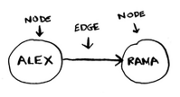
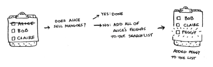
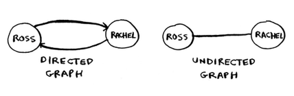
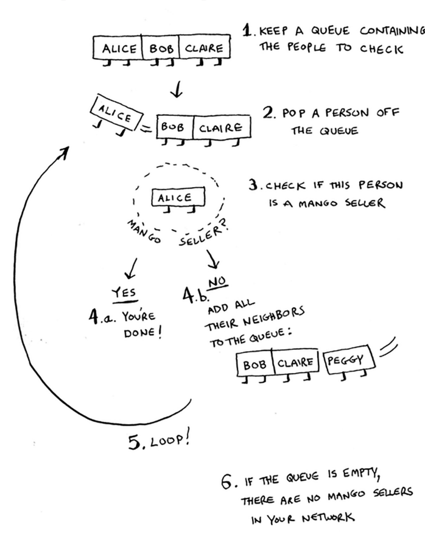

# Chapter 6 - Breadth-first search (BFS)

- BFS can use to checkers AI that  calculates the fewest moves to victory
- Write a spell checker (fewest edits from your misspelling to a read word)
- Find a doctor closest to you in your network

### Graphs

- A graph models a set of connections.
- Mades up of `nodes` & `edges`. A node can be directly connected to many other nodes.
- Those nodes are called `neighbours`
- Graphs are a way to model how different things are connected to one another
    
    
    

### Breadth-first search (BFS)

It helps answer 2 types of questions

1. Is there a path from node A to node B?
2. what is the short path from node A to node B?

- Question example
    
    Make a list of friends to search
    
    Q1: is there a path from node A to node B? (is there a mango seller in your network? )
    
    - go to search each person in the list, and check whether that person sells mangoes
    - each time you search for someone from the list, add all of their friends on the list
    - you search your entire network until you come across a mango seller.
    
    
    
    Q2: what is the shortest path from node A to node B? (who is the closest mango seller?)
    
    - check first-degree connections before second-degree connections
    - search people in the order that they’re added.
    

### Queues

- First in, first out  (FIFO)
- ↔ stack is last in, first out (LIFO)

### Implementing the graph

- hash table, ex: `const graph =  { 'you': ['thom', 'jonny']}`
- Those graphs are equal, but one is directed(only one way), the other is undirected (no arrows)
    
    
    

### Implementing the algorithm



1. Keep a queue containg the people to check
2. pop a person off the queue
3. check if this perons is a mango seller
    1. if yes, you are done!
    2. if no, add all their neighbors to the queue
4. loop back to step2
5. if the queue is empty, there are no mango sellers in your networks

- Python solution
    
    ```python
    def search(name):
     search_queue = deque()
     search_queue += graph[name]
     searched = []
     while search_queue:
    	 person = search_queue.popleft()
    	 if not person in searched:
    		 if person_is_seller(person):
    				print person + “ is a mango seller!”
    				return True
    		 else:
    			 search_queue += graph[person]
    			 searched.append(person)
     return False
    ```
    
- Javascript solution
    
    ```jsx
    function search(name){
    	const searchQueue = graph[name]; // start from the first-level connections
      const searched = new Set();
      
    	while(searchQueue.length) {
    		const person = searchQueue.shift();
    		
    		if(!searched.has(person)) {
    			if(isPersonSeller(person)) {
    				console.log(`${person} is a mango seller!`);
    				return true;
    			} else {
    				searchQueue = [...searchQueue, ...graph[person]];
            searched.add(person);
    			}
    		}
    	}
    	return false;
    }
    
    function isPersonSeller(name) {
    	return name.includes('m');
    }
    ```
    

### Running time

- Adding one person to the queue takes constant time: O(1), doing this for every person will take O(n)
- BFS takes O(number of ppl + number of edges) ⇒ O(V+E);

### Recap

- BFS tells you if there’s a path from A to B
- If there’s a path, BFS will find the shortest path
- If you have a problem like `find the shortest X` try to modelling your problem as a graph, and use BFS to solve it
- Directed graph has arrows, the replationship follows the direction of the arrow
- Undirected graph have no arrrows. the relationship goes both ways
- Queques are FIFO
- Stacks are LIFO
- Once you check someone, make sure you don’t check them again. Otherwise will end up in the infinit loop

### Leetcode

trees