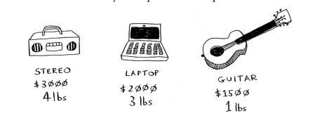
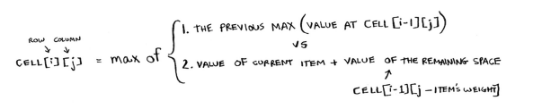
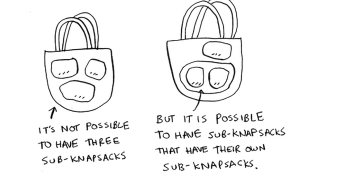
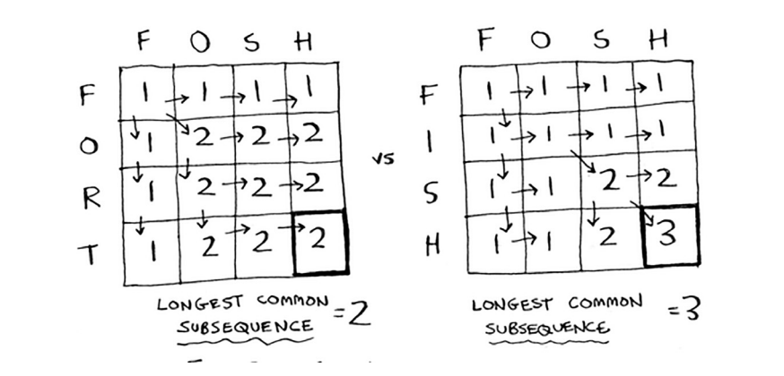

# Chapter 9 - Dynamic programming

### The knapsack problem

You have three items that you can put into the knapsack.
What items should you steal so that you steal the maximum money’s
worth of goods?



### The simple solution

- try every possible set of goods and find the set that gives you the most value (O(2^n) time)
- This is an approximate solution. That solution will beclose to the optimal solution

### Dynamic programming

- optimal solution
- Dynamic programming starts by solving subproblems and builds up to solving the big problem.
- For the knapsack problem, you’ll start by solving the problem for smaller knapsacks (or “sub-knapsacks”) and then work up to solving the original problem.
- starts with a **grid**
- At each cell, there’s a simple decision: do you steal the guitar or not?
1. The first cell has a knapsack of capacity 1 lb. The guitar is also 1 lb, which means it fits into the knapsack! So the value of this cell is $1,500, and it contains a guitar.
2. The row represents the current best guess for this max.
3. The last cell:  current 4lbs is 3000, but add laptop and guitar is 3500. Put the more valuable one.

|                      | 1    | 2    | 3    | 4    |
| -------------------- | ---- | ---- | ---- | ---- |
| Guitar (1500, 1 lbs) | 1500 | 1500 | 1500 | 1500 |
| Stereo(3000, 4lbs)   | 1500 | 1500 | 1500 | 3000 |
| Laptop(2000, 3 lbs)  | 1500 | 1500 | 2000 | 3500 |



- What happends if you add item?
    - Do’t need to recalcuate
- what happends if you change the order of rows?
    - The ordre of the rows doesn’t matter
- Can you fill in the grid column-wise instead of row-wise?
    - this one doesn’t matter. but it can make a difference for other problems
- What happends if you add a a smaller item?
    - If you add 0.5 lbs and it worths 1000. You need to know the value of 3.5lbs knapsacs.
    - Because of the samller item, you have to account for the finer granlarity.
    - The grid row will become. 0.5, 1 , 1.5, 2, …..4
- Can you steal fractions of an item?
    - No, with the dynamic-programming solution, you either take the item or not. You can’t take half item.
    - maybe you should use greedy algorithm
- Handling itmes that depend on each other?
    - Dynamic programin is powerful becaues it can solve subproblems and use those answers to solve the bigger problem.
    - Dynamic programming only works when each subproblem is discrete- when it doesn’t depend on other subproblems
- Is it possible that the solution will require more than 2 sub-knapakcs?
    - It’s not possible to have 3 sub-knapsakcs
    - but it’s possible ot have sub- knapsacks that have their own sub-knapsacks.
        
        
        
- Is it possible that the best solution doesn’t fill the knapsack completely?
    - Yes, image you are steal a diamond

### Take aways

- Dynamic programming is useful when you are trying to optimize something given a constraint.
    - In the knapsack problem, you had to maximize the value of the goods you stole, constrained by the size of the knapsack
- You can use dynamic programming when the problem can be broken into discrete subproblems, and they don’t depend on each other
- Every dynamic-programming solution involves a grid
- The values in the cells are usually what you are trying to optimize.
- Each cell is a subproblem, so think about how you can divde your problem into subproblems

### Long common substring

Suppose someone missspelled the world on the dictionary.com. You want to be able to guess what word they meant. Type: `HISH` , you are guessing it’s `FISH` or `VISTA`

1. Making a grid 
    1. What’s the value of the cells? 
    2. How to divide the problem?
    3. What are the aexes of the gird?
    4. You are trying to find the longes substring that 2 words have in common

The cell: the length of the longest substring that 2 strings have in common

|     | H   | I   | S   | H   |
| --- | --- | --- | --- | --- |
| F   | 0   | 0   | 0   | 0   |
| I   | 0   | 1   | 0   | 0   |
| S   | 0   | 0   | 2   | 0   |
| H   | 0   | 0   | 0   | 3   |

```python
if word_a[i] == word_b[j]: // The letters match.
 cell[i][j] = cell[i-1][j-1] + 1
else:   // The letters don’t match.
 cell[i][j] = 0
```

|     | V   | I   | S   | T   | A   |
| --- | --- | --- | --- | --- | --- |
| F   | 0   | 0   | 0   | 0   | 0   |
| I   | 0   | 1   | 0   | 0   | 0   |
| S   | 0   | 0   | 2   | 0   | 0   |
| H   | 0   | 0   | 0   | 0   | 0   |

- The final solution may not be in the last cell.
- The solution is the largest number in the grid

### Longest commom subsequence

Missspelled `FOSH` guess for `FISH` or `FORT`

- if you use longest commom substrings, they are both 2.
- but what you rewally want th compare is the longest commom subsequences

|     | F   | O   | S   | H   |
| --- | --- | --- | --- | --- |
| F   | 1   | 1   | 1   | 1   |
| I   | 1   | 1   | 1   | 1   |
| S   | 1   | 1   | 2   | 2   |
| H   | 1   | 1   | 2   | 3   |



```python
if word_a[i] == word_b[j]: // The letters match.
 cell[i][j] = cell[i-1][j-1] + 1
else: // The letters don’t match.
 cell[i][j] = max(cell[i-1][j], cell[i][j-1])
```

### Recap

- Dynamic programming is useful when you’re trying to optimize
something given a constraint.
- You can use dynamic programming when the problem can be
broken into discrete subproblems.
- Every dynamic-programming solution involves a grid.
- The values in the cells are usually what you’re trying to optimize.
- Each cell is a subproblem, so think about how you can divide your
problem into subproblems.
- There’s no single formula for calculating a dynamic-programming
solution.